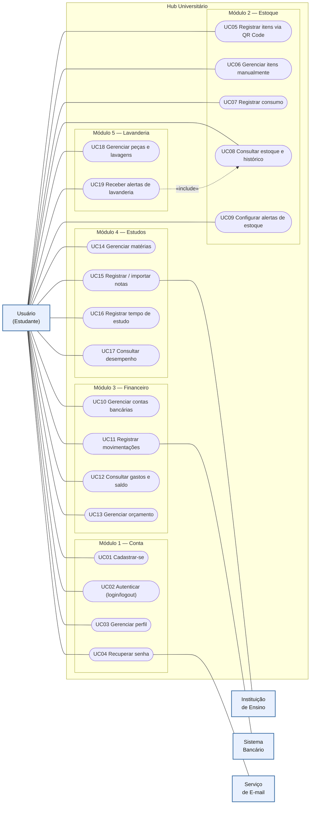

# Casos de Uso

19 casos de uso agrupados por módulo. Um caso de uso representa um objetivo do usuário e agrupa requisitos funcionais relacionados (por isso não é 1:1 com os RFs).

**Ator principal:** Usuário (Estudante). **Atores secundários:** Instituição de Ensino, Sistema Bancário, Serviço de E-mail.

## Lista (com rastreabilidade aos RFs)

**Módulo 1 — Conta**
- UC01 Cadastrar-se — RF001
- UC02 Autenticar (login/logout) — RF002, RF003
- UC03 Gerenciar perfil (dados, avatar, vínculo institucional) — RF004, RF006, RF007
- UC04 Recuperar senha — RF005 *(← Serviço de E-mail)*

**Módulo 2 — Estoque**
- UC05 Registrar itens via QR Code — RF008
- UC06 Gerenciar itens manualmente — RF009
- UC07 Registrar consumo — RF010
- UC08 Consultar estoque e histórico — RF011, RF013
- UC09 Configurar alertas de estoque — RF012

**Módulo 3 — Financeiro**
- UC10 Gerenciar contas bancárias — RF014
- UC11 Registrar movimentações — RF015 *(← Sistema Bancário)*, RF016, RF017
- UC12 Consultar gastos e saldo — RF018, RF019
- UC13 Gerenciar orçamento — RF020, RF021

**Módulo 4 — Estudos**
- UC14 Gerenciar matérias — RF022
- UC15 Registrar / importar notas — RF024, RF023 *(← Instituição de Ensino)*
- UC16 Registrar tempo de estudo — RF025
- UC17 Consultar desempenho — RF026, RF027, RF028

**Módulo 5 — Lavanderia**
- UC18 Gerenciar peças e lavagens — RF029, RF030, RF032
- UC19 Receber alertas de lavanderia — RF031, RF033 *(inclui consulta ao estoque)*

## Diagrama (Mermaid)

