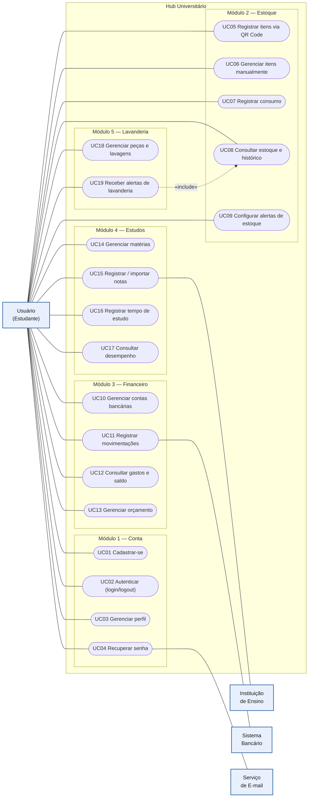

# Xepa — Documentação Completa

Documento consolidado da modelagem. Os mesmos conteúdos estão disponíveis separados por artefato nos arquivos `01`–`06` desta pasta.

## Índice
1. Visão Geral
2. Requisitos (RF / RN / RNF)
3. Casos de Uso
4. Modelo de Dados (ER)
5. Diagramas de Sequência
6. Arquitetura

---

# Visão Geral

## Problema

Estudantes universitários que passam a morar sozinhos pela primeira vez lidam, ao mesmo tempo, com a pressão da faculdade e com uma rotina doméstica para a qual não têm experiência: comprar e não desperdiçar comida, controlar o dinheiro, acompanhar o próprio desempenho acadêmico e dar conta de tarefas como lavar roupa. Essas frentes normalmente exigem vários apps desconexos.

## Proposta

**Xepa** unifica, num único hub mobile, quatro frentes dessa rotina — despensa, finanças, estudos e lavanderia —, com foco em aproveitar bem recursos limitados. O nome vem da gíria de feira ("xepa" = as sobras baratas do fim da feira).

## Ator

- **Usuário (estudante)** — ator principal e único do sistema.

Sistemas externos que apoiam alguns fluxos: **Instituição de Ensino** (importação de notas), **Sistema Bancário** (notificações de movimentação) e **Serviço de E-mail** (recuperação de senha).

## Módulos

| Módulo | Nome no produto | Responsabilidade |
|--------|-----------------|------------------|
| 1 | Conta / Autenticação | cadastro, login/logout, perfil, recuperação de senha, vínculo institucional |
| 2 | Despensa | controle de estoque (QR Code da nota, consumo, alertas, histórico) |
| 3 | Grana | finanças (contas, transações, orçamento por categoria, resumos) |
| 4 | Cabeça | estudos (matérias, notas, sessões de estudo, desempenho) |
| 5 | Roupa | lavanderia (peças, uso, lavagens, lembretes) |

Convenções de produto: a home é chamada de **"a banca"** e o resumo mensal, **"a sacola"**.

## Identidade visual

Base off-white (papel), tinta quase preta, **olive profundo** como única cor primária, e tons dessaturados por módulo usados só como pequenos acentos. Tipografia: Anton, Permanent Marker e Instrument Sans. Detalhe completo no brand kit do projeto.


---

# Requisitos Funcionais e Regras de Negócio

## Contexto

Aplicação voltada a estudantes universitários que estão lidando pela primeira vez com a rotina de morar sozinhos e com a pressão da faculdade. O sistema unifica, em um único hub, o controle de estoque doméstico, a gestão financeira, o acompanhamento dos estudos e a gestão da lavanderia.

**Ator do sistema:** Usuário (o estudante).

---

## Requisitos Funcionais

### Módulo 1 — Autenticação e Conta

| ID | Descrição |
|----|-----------|
| RF001 | O sistema deve permitir que o usuário crie uma conta informando nome, e-mail e senha. |
| RF002 | O sistema deve permitir que o usuário faça login com e-mail e senha. |
| RF003 | O sistema deve permitir que o usuário encerre a sessão (logout). |
| RF004 | O sistema deve permitir que o usuário edite os dados do seu perfil. |
| RF005 | O sistema deve permitir que o usuário recupere/redefina a senha. |
| RF006 | O sistema deve permitir que o usuário vincule uma instituição de ensino, habilitando a importação automática de notas. |
| RF007 | O sistema deve permitir que o usuário escolha uma foto de perfil dentre os avatares disponíveis. |

### Módulo 2 — Controle de Estoque (Despensa)

| ID | Descrição |
|----|-----------|
| RF008 | O sistema deve permitir que o usuário adicione itens ao estoque por leitura do QR Code da nota fiscal. |
| RF009 | O sistema deve permitir que o usuário adicione e edite itens manualmente. |
| RF010 | O sistema deve permitir que o usuário registre o consumo (baixa) de itens. |
| RF011 | O sistema deve exibir a lista de itens em estoque com suas quantidades. |
| RF012 | O sistema deve permitir que o usuário escolha quais itens deseja monitorar e defina a quantidade mínima de cada um, alertando quando o item atingir esse limite. |
| RF013 | O sistema deve exibir o histórico de valor pago e o local de compra por item. |

### Módulo 3 — Gestão Financeira

| ID | Descrição |
|----|-----------|
| RF014 | O sistema deve permitir que o usuário cadastre contas bancárias. |
| RF015 | O sistema deve registrar automaticamente entradas e saídas de valor a partir das notificações bancárias. |
| RF016 | O sistema deve calcular os gastos a partir dos valores das notas fiscais lidas. |
| RF017 | O sistema deve permitir o registro manual de despesas (valor, categoria, data). |
| RF018 | O sistema deve exibir um resumo de gastos por período e por categoria. |
| RF019 | O sistema deve exibir o saldo categorizado por conta bancária. |
| RF020 | O sistema deve permitir que o usuário defina orçamentos mensais por categoria (ex.: R$ 300 em mercado, R$ 200 em lazer). |
| RF021 | O sistema deve alertar quando os gastos de uma categoria se aproximarem ou ultrapassarem o orçamento definido para ela. |

### Módulo 4 — Acompanhamento de Estudos

| ID | Descrição |
|----|-----------|
| RF022 | O sistema deve permitir que o usuário cadastre matérias/disciplinas. |
| RF023 | O sistema deve importar notas automaticamente da instituição vinculada. |
| RF024 | O sistema deve permitir o registro manual de notas por matéria. |
| RF025 | O sistema deve permitir o registro do tempo de estudo (sessões). |
| RF026 | O sistema deve calcular a média das notas por matéria. |
| RF027 | O sistema deve exibir métricas de progressão de notas por matéria (evolução ao longo do tempo). |
| RF028 | O sistema deve exibir estatísticas de tempo de estudo. |

### Módulo 5 — Gestão de Lavanderia

| ID | Descrição |
|----|-----------|
| RF029 | O sistema deve permitir o cadastro de peças de roupa com uma regra de lavagem (nº de usos antes de lavar). |
| RF030 | O sistema deve permitir registrar o uso de uma peça. |
| RF031 | O sistema deve notificar o usuário quando uma peça atingir o limite de usos. |
| RF032 | O sistema deve permitir agendar lavagens e emitir lembretes. |
| RF033 | O sistema deve consultar o estoque e alertar sobre a falta de sabão e amaciante. |

---

## Regras de Negócio

| ID | Descrição |
|----|-----------|
| RN01 | O e-mail de cadastro deve ser único no sistema. |
| RN02 | A senha deve ter no mínimo 8 caracteres, contendo ao menos uma letra maiúscula, um número e um caractere especial. |
| RN03 | No logout, o token da sessão deve ser invalidado. |
| RN04 | A foto de perfil deve ser escolhida apenas dentre os avatares pré-definidos (sem upload próprio). |
| RN05 | A importação automática de notas só ocorre com um vínculo institucional ativo. |
| RN06 | Uma nota fiscal já processada não pode ser lida novamente (evitar duplicidade de itens e gastos). |
| RN07 | A baixa de estoque não pode deixar a quantidade negativa. |
| RN08 | O alerta de estoque é disparado quando a quantidade de um item monitorado atingir ou ficar abaixo da quantidade mínima que o usuário definiu para aquele item. |
| RN09 | Todo lançamento automático deve estar vinculado a uma conta bancária cadastrada. |
| RN10 | O saldo de uma conta é igual ao saldo inicial somado às entradas e subtraído das saídas daquela conta. |
| RN11 | O gasto do mês é a soma de todas as despesas (notas + manuais + saídas) dentro do mês de referência. |
| RN12 | O alerta de orçamento dispara ao atingir 80% do limite definido para a categoria no mês de referência. |
| RN13 | Sabão e amaciante são tratados como itens de estoque; a falta é sinalizada antes de uma lavagem agendada. |
| RN14 | Uma peça só entra na lista de "lavar" após atingir o número de usos definido pelo usuário para aquela peça (ex.: calça jeans após 4 usos). |
| RN15 | A média de uma matéria é calculada segundo o método definido pelo usuário (simples ou ponderada). |
| RN16 | A métrica de progressão compara as notas de uma matéria ao longo das avaliações e do tempo. |
| RN17 | Cada categoria pode ter no máximo um orçamento por mês de referência (único por usuário + categoria + mês). |
| RN18 | A leitura de nota fiscal (QR Code) contempla apenas notas de mercado/supermercado; toda transação gerada por nota é automaticamente categorizada como "Mercado". |

---

## Requisitos Não Funcionais

### Usabilidade

| ID | Descrição |
|----|-----------|
| RNF01 | A interface deve ser intuitiva e adequada a usuários sem experiência prévia, permitindo realizar as tarefas principais sem treinamento. |
| RNF02 | O sistema deve fornecer feedback visual claro para cada ação (sucesso, erro, carregamento). |
| RNF03 | O sistema deve oferecer um fluxo de onboarding inicial apresentando os módulos. |

### Desempenho

| ID | Descrição |
|----|-----------|
| RNF04 | A leitura do QR Code da nota fiscal deve processar e retornar os itens em até 5 segundos. |
| RNF05 | As telas principais devem carregar em até 3 segundos em conexão padrão. |

### Segurança

| ID | Descrição |
|----|-----------|
| RNF06 | As senhas devem ser armazenadas com hash e salt, nunca em texto puro. |
| RNF07 | Dados sensíveis (financeiros e pessoais) devem trafegar e ser armazenados de forma criptografada. |
| RNF08 | O sistema deve estar em conformidade com a LGPD quanto à coleta, uso e armazenamento de dados pessoais. |
| RNF09 | A sessão deve expirar após 30 minutos de inatividade. |

### Confiabilidade e Disponibilidade

| ID | Descrição |
|----|-----------|
| RNF10 | O sistema deve ter disponibilidade mínima de 99%. |
| RNF11 | Os dados do usuário devem ter rotina de backup periódico. |

### Compatibilidade e Portabilidade

| ID | Descrição |
|----|-----------|
| RNF12 | O aplicativo deve funcionar em dispositivos móveis Android 10 ou superior e iOS 15 ou superior. |
| RNF13 | A leitura automática de notificações bancárias (RF015) depende de permissões do sistema operacional e pode não estar disponível no iOS; nesses casos, o registro manual de despesas (RF017) deve suprir a função. |

### Manutenibilidade

| ID | Descrição |
|----|-----------|
| RNF14 | O sistema deve seguir a arquitetura em camadas (Cliente, Controller, Service, Repository e Banco de Dados). |
| RNF15 | O código deve ser versionado e documentado. |

### Escalabilidade

| ID | Descrição |
|----|-----------|
| RNF16 | A arquitetura deve suportar o crescimento no número de usuários e no volume de dados sem degradação significativa de desempenho. |


---

# Casos de Uso

19 casos de uso agrupados por módulo. Um caso de uso representa um objetivo do usuário e agrupa requisitos funcionais relacionados (por isso não é 1:1 com os RFs).

**Ator principal:** Usuário (Estudante). **Atores secundários:** Instituição de Ensino, Sistema Bancário, Serviço de E-mail.

## Lista (com rastreabilidade aos RFs)

**Módulo 1 — Conta**
- UC01 Cadastrar-se — RF001
- UC02 Autenticar (login/logout) — RF002, RF003
- UC03 Gerenciar perfil (dados, avatar, vínculo institucional) — RF004, RF006, RF007
- UC04 Recuperar senha — RF005 *(← Serviço de E-mail)*

**Módulo 2 — Estoque**
- UC05 Registrar itens via QR Code — RF008
- UC06 Gerenciar itens manualmente — RF009
- UC07 Registrar consumo — RF010
- UC08 Consultar estoque e histórico — RF011, RF013
- UC09 Configurar alertas de estoque — RF012

**Módulo 3 — Financeiro**
- UC10 Gerenciar contas bancárias — RF014
- UC11 Registrar movimentações — RF015 *(← Sistema Bancário)*, RF016, RF017
- UC12 Consultar gastos e saldo — RF018, RF019
- UC13 Gerenciar orçamento — RF020, RF021

**Módulo 4 — Estudos**
- UC14 Gerenciar matérias — RF022
- UC15 Registrar / importar notas — RF024, RF023 *(← Instituição de Ensino)*
- UC16 Registrar tempo de estudo — RF025
- UC17 Consultar desempenho — RF026, RF027, RF028

**Módulo 5 — Lavanderia**
- UC18 Gerenciar peças e lavagens — RF029, RF030, RF032
- UC19 Receber alertas de lavanderia — RF031, RF033 *(inclui consulta ao estoque)*

## Diagrama (Mermaid)




---

# Modelo de Dados (ER)

Banco relacional, 18 entidades cobrindo os 5 módulos. Código na DSL do Eraser (inserir um **Entity Relationship Diagram** e colar).

## Notas de design (importante)

- **Unicidade**: `USUARIO.email` (RN01) e `NOTA_FISCAL.chave_acesso` (RN06) são únicos. `ORCAMENTO` é único por `usuario_id + categoria_id + mes_referencia` (RN17).
- **Nota → 1 transação**: `NOTA_FISCAL` ↔ `TRANSACAO` é 1:1; uma nota processada gera exatamente uma transação (origem="nota", categoria="Mercado" por RN18). O gasto do mês (RN11) sai só de `TRANSACAO`, sem dupla contagem.
- **Duas categorias distintas**: `PRODUTO.categoria` é texto livre (despensa); `CATEGORIA` é entidade (financeira) e é a que o `ORCAMENTO` referencia.
- **Desnormalização intencional**: `PRODUTO.quantidade_atual` e `PECA_ROUPA.usos_atuais` são deriváveis (de `MOVIMENTACAO_ESTOQUE` e `USO_PECA`), mas mantidos como coluna para leitura rápida — atualizar a cada movimentação.
- **Estoque vs. financeiro**: `MOVIMENTACAO_ESTOQUE` (entrada/baixa de itens) é separada de `TRANSACAO` (movimento financeiro).
- **Sabão e amaciante** são `PRODUTO` como os demais (RN13).

## Código Eraser

```entity-relationship-diagram
title ER do sistema

USUARIO [color: Purple] {
  id int [pk]
  nome string
  email string [unique, note: "único (RN01)"]
  senha_hash string
  salt string
  avatar_id int [fk]
  instituicao_id int [fk, note: "nulo se sem vínculo"]
  criado_em datetime
}

INSTITUICAO {
  id int [pk]
  nome string
}

AVATAR [color: Black] {
  id int [pk]
  descricao string
  url string
}

PRODUTO [color: Blue] {
  id int [pk]
  usuario_id int [fk]
  nome string
  categoria string [note: "texto livre; distinta da entidade CATEGORIA (financeira)"]
  unidade string
  quantidade_atual decimal
  monitorado boolean [note: "RF012"]
  quantidade_minima decimal [note: "RN08"]
}

NOTA_FISCAL [color: Green] {
  id int [pk]
  usuario_id int [fk]
  chave_acesso string [unique, note: "único (RN06)"]
  local_compra string
  data_compra date
  valor_total decimal
  processada boolean [note: "nota processada gera 1 TRANSACAO (origem='nota')"]
}

ITEM_NOTA {
  id int [pk]
  nota_fiscal_id int [fk]
  produto_id int [fk]
  descricao string
  quantidade decimal
  valor_unitario decimal
}

MOVIMENTACAO_ESTOQUE {
  id int [pk]
  produto_id int [fk]
  tipo string [note: "entrada / baixa"]
  quantidade decimal
  data datetime
}

CONTA_BANCARIA {
  id int [pk]
  usuario_id int [fk]
  nome_banco string
  saldo_inicial decimal
}

CATEGORIA {
  id int [pk]
  usuario_id int [fk]
  nome string
}

TRANSACAO [color: Red] {
  id int [pk]
  conta_id int [fk]
  categoria_id int [fk]
  nota_fiscal_id int [fk, note: "nulo se manual/auto; gasto do mês (RN11) sai só daqui, sem dupla contagem"]
  tipo string [note: "entrada / saida"]
  valor decimal
  data date
  origem string [note: "automatica / manual / nota"]
  descricao string
}

ORCAMENTO {
  id int [pk]
  usuario_id int [fk]
  categoria_id int [fk]
  mes_referencia string [note: "único por usuário + categoria + mês (RN17)"]
  valor_limite decimal [note: "alerta em 80% (RN12)"]
}

MATERIA [color: Orange] {
  id int [pk]
  usuario_id int [fk]
  nome string
  metodo_media string [note: "simples / ponderada (RN15)"]
}

AVALIACAO [color: Yellow] {
  id int [pk]
  materia_id int [fk]
  descricao string
  valor decimal
  peso decimal
  data date
  origem string [note: "manual / importada"]
}

SESSAO_ESTUDO {
  id int [pk]
  materia_id int [fk]
  data date
  duracao_min int
}

PECA_ROUPA {
  id int [pk]
  usuario_id int [fk]
  nome string
  tipo string
  limite_usos int [note: "RN14"]
  usos_atuais int
}

USO_PECA {
  id int [pk]
  peca_id int [fk]
  data datetime
}

LAVAGEM {
  id int [pk]
  usuario_id int [fk]
  data_agendada datetime
  status string
  lembrete_ativo boolean
}

LAVAGEM_PECA {
  id int [pk]
  lavagem_id int [fk]
  peca_id int [fk]
}

// ===== RELACIONAMENTOS =====

INSTITUICAO.id > USUARIO.instituicao_id
AVATAR.id > USUARIO.avatar_id
USUARIO.id > CONTA_BANCARIA.usuario_id
USUARIO.id > PRODUTO.usuario_id
USUARIO.id > NOTA_FISCAL.usuario_id
USUARIO.id > CATEGORIA.usuario_id
USUARIO.id > ORCAMENTO.usuario_id
USUARIO.id > MATERIA.usuario_id
USUARIO.id > PECA_ROUPA.usuario_id
USUARIO.id > LAVAGEM.usuario_id
NOTA_FISCAL.id > ITEM_NOTA.nota_fiscal_id
PRODUTO.id > ITEM_NOTA.produto_id
PRODUTO.id > MOVIMENTACAO_ESTOQUE.produto_id
CONTA_BANCARIA.id > TRANSACAO.conta_id
CATEGORIA.id > TRANSACAO.categoria_id
CATEGORIA.id > ORCAMENTO.categoria_id
NOTA_FISCAL.id - TRANSACAO.nota_fiscal_id
MATERIA.id > AVALIACAO.materia_id
MATERIA.id > SESSAO_ESTUDO.materia_id
PECA_ROUPA.id > USO_PECA.peca_id
LAVAGEM.id > LAVAGEM_PECA.lavagem_id
PECA_ROUPA.id > LAVAGEM_PECA.peca_id
```


---

# Diagramas de Sequência — sintaxe Eraser

Cada bloco abaixo é um diagrama independente. No Eraser: menu de inserção (+) → Diagram-as-code → **Sequence diagram** → cole o conteúdo do bloco correspondente.

Convenções: `>` chamada · `-->` retorno · `alt/else/opt/loop { }` controle de fluxo · `autoNumber on` numera os passos.

---

## Módulo 1 — Autenticação e Conta

### SD01 — Cadastro de usuário (RF001, RN01, RN02, RNF06)

```sequence-diagram
// SD01 — Cadastro de usuário
autoNumber on

Cliente > Controller: POST /cadastro (nome, email, senha)
Controller > Service: cadastrar(dados)
Service > Service: validar senha (RN02)
alt [label: senha fora do padrão] {
  Service --> Controller: erro 400 (senha inválida)
  Controller --> Cliente: 400 Bad Request
}
else [label: senha válida] {
  Service > Repository: buscarPorEmail(email)
  Repository > DB [label: "Banco de Dados"]: SELECT usuario WHERE email
  DB --> Repository: usuario / null
  Repository --> Service: usuario / null
  alt [label: e-mail já cadastrado (RN01)] {
    Service --> Controller: erro 409 (e-mail em uso)
    Controller --> Cliente: 409 Conflict
  }
  else [label: e-mail disponível] {
    Service > Service: gerar hash + salt (RNF06)
    Service > Repository: salvar(usuario)
    Repository > DB: INSERT usuario
    DB --> Repository: id
    Repository --> Service: usuario criado
    Service --> Controller: sucesso
    Controller --> Cliente: 201 Created
  }
}
```

### SD02 — Login (RF002, RN02, RNF09)

```sequence-diagram
// SD02 — Login
autoNumber on

Cliente > Controller: POST /login (email, senha)
Controller > Service: autenticar(email, senha)
Service > Repository: buscarPorEmail(email)
Repository > DB [label: "Banco de Dados"]: SELECT usuario WHERE email
DB --> Repository: usuario / null
Repository --> Service: usuario / null
alt [label: usuário não encontrado ou senha incorreta] {
  Service --> Controller: erro 401
  Controller --> Cliente: 401 Unauthorized
}
else [label: credenciais válidas] {
  Service > Service: verificar hash da senha
  Service > Service: gerar token de sessão
  Service > Repository: registrarToken(usuario_id, token)
  Repository > DB: UPDATE usuario SET token
  DB --> Repository: ok
  Service --> Controller: token
  Controller --> Cliente: 200 OK (token)
}
```

### SD03 — Logout (RF003, RN03)

```sequence-diagram
// SD03 — Logout
autoNumber on

Cliente > Controller: POST /logout (token)
Controller > Service: encerrarSessao(token)
Service > Repository: buscarPorToken(token)
Repository > DB [label: "Banco de Dados"]: SELECT usuario WHERE token
DB --> Repository: usuario / null
Repository --> Service: usuario / null
alt [label: token inválido ou expirado] {
  Service --> Controller: erro 401
  Controller --> Cliente: 401 Unauthorized
}
else [label: token válido] {
  Service > Repository: invalidarToken(usuario_id)
  Repository > DB: UPDATE usuario SET token = null (RN03)
  DB --> Repository: ok
  Service --> Controller: sucesso
  Controller --> Cliente: 200 OK (sessão encerrada)
}
```

### SD04 — Recuperação de senha (RF005)

```sequence-diagram
// SD04 — Recuperação de senha
autoNumber on

Cliente > Controller: POST /recuperar-senha (email)
Controller > Service: solicitarRecuperacao(email)
Service > Repository: buscarPorEmail(email)
Repository > DB [label: "Banco de Dados"]: SELECT usuario WHERE email
DB --> Repository: usuario / null
Repository --> Service: usuario / null
opt [label: e-mail encontrado] {
  Service > Service: gerar token de redefinição
  Service > Repository: salvarTokenRecuperacao(usuario_id, token)
  Repository > DB: UPDATE usuario SET token_recuperacao
  DB --> Repository: ok
  Service > Email [label: "Serviço de E-mail"]: enviar link de redefinição
  Email --> Service: enviado
}
// resposta genérica p/ não revelar se o e-mail existe
Service --> Controller: resposta genérica
Controller --> Cliente: 200 OK
```

### SD05 — Editar perfil, avatar e vínculo institucional (RF004, RF006, RF007, RN04, RN05)

```sequence-diagram
// SD05 — Editar perfil, avatar e vínculo
autoNumber on

Cliente > Controller: PUT /perfil (nome, avatar_id, instituicao_id)
Controller > Service: atualizarPerfil(usuario_id, dados)
opt [label: avatar informado] {
  Service > Repository: validarAvatar(avatar_id)
  Repository > DB [label: "Banco de Dados"]: SELECT avatar WHERE id (RN04)
  DB --> Repository: avatar / null
}
opt [label: instituição informada] {
  Service > Repository: validarInstituicao(instituicao_id)
  Repository > DB: SELECT instituicao WHERE id (RN05)
  DB --> Repository: instituicao / null
}
alt [label: dados inválidos] {
  Service --> Controller: erro 400
  Controller --> Cliente: 400 Bad Request
}
else [label: válido] {
  Service > Repository: atualizar(usuario)
  Repository > DB: UPDATE usuario
  DB --> Repository: ok
  Service --> Controller: sucesso
  Controller --> Cliente: 200 OK
}
```

---

## Módulo 2 — Controle de Estoque

### SD06 — Leitura de nota fiscal via QR Code (RF008, RN06, RN18)

```sequence-diagram
// SD06 — Leitura de nota fiscal via QR Code
autoNumber on

Cliente > Cliente: ler QR Code da nota (mercado)
Cliente > Controller: POST /notas (chave_acesso, itens)
Controller > Service: processarNota(usuario_id, chave_acesso, itens)
Service > Repository: buscarPorChave(chave_acesso)
Repository > DB [label: "Banco de Dados"]: SELECT nota_fiscal WHERE chave_acesso
DB --> Repository: nota / null
Repository --> Service: nota / null
alt [label: nota já processada (RN06)] {
  Service --> Controller: erro 409 (nota duplicada)
  Controller --> Cliente: 409 Conflict
}
else [label: nota nova] {
  Service > Repository: salvarNota + itens
  Repository > DB: INSERT nota_fiscal, INSERT item_nota
  DB --> Repository: ok
  loop [label: para cada item] {
    Service > Repository: registrarEntradaEstoque(produto)
    Repository > DB: INSERT movimentacao_estoque (entrada)
    Repository > DB: UPDATE produto SET quantidade_atual
  }
  Service > Repository: gerarTransacao (origem=nota, categoria=Mercado)
  Repository > DB: INSERT transacao (RN18)
  Service > Repository: marcarProcessada
  Repository > DB: UPDATE nota_fiscal SET processada = true
  DB --> Repository: ok
  Service --> Controller: sucesso (itens + gasto)
  Controller --> Cliente: 201 Created
}
```

### SD07 — Cadastro/edição manual de item (RF009)

```sequence-diagram
// SD07 — Cadastro/edição manual de item
autoNumber on

Cliente > Controller: POST/PUT /produtos (dados)
Controller > Service: salvarProduto(usuario_id, dados)
alt [label: criação] {
  Service > Repository: inserir(produto)
  Repository > DB [label: "Banco de Dados"]: INSERT produto
}
else [label: edição] {
  Service > Repository: atualizar(produto)
  Repository > DB: UPDATE produto
}
DB --> Repository: ok
Repository --> Service: produto
Service --> Controller: sucesso
Controller --> Cliente: 200 / 201
```

### SD08 — Registro de consumo / baixa de estoque (RF010, RN07, RN08)

```sequence-diagram
// SD08 — Registro de consumo / baixa de estoque
autoNumber on

Cliente > Controller: POST /produtos/{id}/consumo (quantidade)
Controller > Service: registrarConsumo(produto_id, quantidade)
Service > Repository: buscarProduto(produto_id)
Repository > DB [label: "Banco de Dados"]: SELECT produto
DB --> Repository: produto
Repository --> Service: produto
alt [label: quantidade maior que o estoque (RN07)] {
  Service --> Controller: erro 422 (estoque insuficiente)
  Controller --> Cliente: 422 Unprocessable
}
else [label: baixa permitida] {
  Service > Repository: registrarBaixa
  Repository > DB: INSERT movimentacao_estoque (baixa)
  Repository > DB: UPDATE produto SET quantidade_atual
  DB --> Repository: quantidade_atual, quantidade_minima, monitorado
  opt [label: item monitorado e quantidade atingiu a mínima (RN08)] {
    Service --> Cliente: notificação de reposição
  }
  Service --> Controller: sucesso
  Controller --> Cliente: 200 OK
}
```

### SD09 — Consultar estoque e histórico (RF011, RF013)

```sequence-diagram
// SD09 — Consultar estoque e histórico
autoNumber on

Cliente > Controller: GET /produtos
Controller > Service: listarEstoque(usuario_id)
Service > Repository: buscarProdutos + histórico
Repository > DB [label: "Banco de Dados"]: SELECT produto
Repository > DB: SELECT item_nota JOIN nota_fiscal (valor pago, local)
DB --> Repository: dados
Repository --> Service: lista com quantidades e histórico
Service --> Controller: lista
Controller --> Cliente: 200 OK
```

### SD10 — Configurar alerta de item (RF012)

```sequence-diagram
// SD10 — Configurar alerta de item
autoNumber on

Cliente > Controller: PUT /produtos/{id}/monitoramento (monitorado, quantidade_minima)
Controller > Service: configurarAlerta(produto_id, dados)
Service > Repository: atualizar(produto)
Repository > DB [label: "Banco de Dados"]: UPDATE produto SET monitorado, quantidade_minima
DB --> Repository: ok
Service --> Controller: sucesso
Controller --> Cliente: 200 OK
```

---

## Módulo 3 — Gestão Financeira

### SD11 — Cadastrar conta bancária (RF014)

```sequence-diagram
// SD11 — Cadastrar conta bancária
autoNumber on

Cliente > Controller: POST /contas (nome_banco, saldo_inicial)
Controller > Service: cadastrarConta(usuario_id, dados)
Service > Repository: inserir(conta)
Repository > DB [label: "Banco de Dados"]: INSERT conta_bancaria
DB --> Repository: id
Service --> Controller: sucesso
Controller --> Cliente: 201 Created
```

### SD12 — Registro automático via notificação bancária (RF015, RN09, RN10)

```sequence-diagram
// SD12 — Registro automático via notificação bancária
autoNumber on

Banco [label: "Sistema Bancário"] > Cliente: notificação de movimentação (valor, tipo)
Cliente > Controller: POST /transacoes/auto (dados)
Controller > Service: registrarAutomatica(dados)
Service > Repository: buscarContaVinculada
Repository > DB [label: "Banco de Dados"]: SELECT conta_bancaria
DB --> Repository: conta / null
Repository --> Service: conta / null
alt [label: sem conta vinculada (RN09)] {
  Service --> Controller: erro 422 (lançamento requer conta)
  Controller --> Cliente: 422 Unprocessable
}
else [label: conta encontrada] {
  Service > Repository: inserirTransacao (origem=automatica)
  Repository > DB: INSERT transacao
  DB --> Repository: ok
  Service > Service: saldo = saldo_inicial + entradas - saídas (RN10)
  Service --> Controller: sucesso
  Controller --> Cliente: 201 Created
}
```

### SD13 — Registro manual de despesa + alerta de orçamento (RF017, RN11, RN12)

```sequence-diagram
// SD13 — Registro manual de despesa + alerta de orçamento
autoNumber on

Cliente > Controller: POST /transacoes (valor, categoria, data)
Controller > Service: registrarDespesa(usuario_id, dados)
Service > Repository: inserirTransacao (origem=manual)
Repository > DB [label: "Banco de Dados"]: INSERT transacao
DB --> Repository: ok
Service > Repository: somarGastosCategoriaMes(categoria, mês)
Repository > DB: SELECT SUM(valor) transacao WHERE categoria e mês (RN11)
DB --> Repository: total
Service > Repository: buscarOrcamento(categoria, mês)
Repository > DB: SELECT orcamento
DB --> Repository: orcamento / null
opt [label: gasto atingiu 80% do limite da categoria (RN12)] {
  Service --> Cliente: alerta de orçamento
}
Service --> Controller: sucesso
Controller --> Cliente: 201 Created
```

### SD14 — Consultar gastos e saldo (RF018, RF019, RN10, RN11)

```sequence-diagram
// SD14 — Consultar gastos e saldo
autoNumber on

Cliente > Controller: GET /financeiro/resumo (período)
Controller > Service: obterResumo(usuario_id, período)
Service > Repository: gastosPorCategoria + saldoPorConta
Repository > DB [label: "Banco de Dados"]: SELECT transacao GROUP BY categoria (RF018)
Repository > DB: SELECT conta + SUM(transacao) (RF019 e RN10)
DB --> Repository: dados
Repository --> Service: resumo
Service --> Controller: resumo
Controller --> Cliente: 200 OK
```

### SD15 — Definir orçamento por categoria (RF020, RN17)

```sequence-diagram
// SD15 — Definir orçamento por categoria
autoNumber on

Cliente > Controller: POST /orcamentos (categoria, mês, valor_limite)
Controller > Service: definirOrcamento(usuario_id, dados)
Service > Repository: buscarOrcamento(categoria, mês)
Repository > DB [label: "Banco de Dados"]: SELECT orcamento WHERE usuario e categoria e mês
DB --> Repository: orcamento / null
Repository --> Service: orcamento / null
alt [label: já existe orçamento p/ a categoria no mês (RN17)] {
  Service > Repository: atualizar(orcamento)
  Repository > DB: UPDATE orcamento
}
else [label: novo] {
  Service > Repository: inserir(orcamento)
  Repository > DB: INSERT orcamento
}
DB --> Repository: ok
Service --> Controller: sucesso
Controller --> Cliente: 200 / 201
```

---

## Módulo 4 — Acompanhamento de Estudos

### SD16 — Cadastrar matéria (RF022, RN15)

```sequence-diagram
// SD16 — Cadastrar matéria
autoNumber on

Cliente > Controller: POST /materias (nome, metodo_media)
Controller > Service: cadastrarMateria(usuario_id, dados)
Service > Repository: inserir(materia)
Repository > DB [label: "Banco de Dados"]: INSERT materia (metodo_media: simples/ponderada)
DB --> Repository: id
Service --> Controller: sucesso
Controller --> Cliente: 201 Created
```

### SD17 — Importar notas da instituição (RF023, RN05)

```sequence-diagram
// SD17 — Importar notas da instituição
autoNumber on

Cliente > Controller: POST /notas/importar
Controller > Service: importarNotas(usuario_id)
Service > Repository: buscarVinculo(usuario_id)
Repository > DB [label: "Banco de Dados"]: SELECT usuario.instituicao_id
DB --> Repository: instituicao_id / null
Repository --> Service: vínculo
alt [label: sem vínculo ativo (RN05)] {
  Service --> Controller: erro 422 (vínculo institucional necessário)
  Controller --> Cliente: 422 Unprocessable
}
else [label: vínculo ativo] {
  Service > Instituicao [label: "Instituição de Ensino"]: solicitar notas do aluno
  Instituicao --> Service: notas (origem=importada)
  loop [label: cada nota recebida] {
    Service > Repository: salvarAvaliacao(materia, valor, origem=importada)
    Repository > DB: INSERT avaliacao
  }
  DB --> Repository: ok
  Service --> Controller: sucesso
  Controller --> Cliente: 200 OK
}
```

### SD18 — Registrar nota manualmente (RF024)

```sequence-diagram
// SD18 — Registrar nota manualmente
autoNumber on

Cliente > Controller: POST /materias/{id}/avaliacoes (descricao, valor, peso, data)
Controller > Service: registrarNota(materia_id, dados)
Service > Repository: inserir(avaliacao origem=manual)
Repository > DB [label: "Banco de Dados"]: INSERT avaliacao
DB --> Repository: ok
Service --> Controller: sucesso
Controller --> Cliente: 201 Created
```

### SD19 — Registrar sessão de estudo (RF025)

```sequence-diagram
// SD19 — Registrar sessão de estudo
autoNumber on

Cliente > Controller: POST /materias/{id}/sessoes (data, duracao_min)
Controller > Service: registrarSessao(materia_id, dados)
Service > Repository: inserir(sessao_estudo)
Repository > DB [label: "Banco de Dados"]: INSERT sessao_estudo
DB --> Repository: ok
Service --> Controller: sucesso
Controller --> Cliente: 201 Created
```

### SD20 — Consultar desempenho (RF026, RF027, RF028, RN15, RN16)

```sequence-diagram
// SD20 — Consultar desempenho
autoNumber on

Cliente > Controller: GET /materias/{id}/desempenho
Controller > Service: obterDesempenho(materia_id)
Service > Repository: buscarAvaliacoes + sessoes + metodo_media
Repository > DB [label: "Banco de Dados"]: SELECT avaliacao e sessao_estudo e materia
DB --> Repository: dados
Repository --> Service: dados
Service > Service: calcular média simples ou ponderada (RN15)
Service > Service: calcular progressão ao longo do tempo (RN16)
Service > Service: consolidar estatísticas de tempo (RF028)
Service --> Controller: métricas
Controller --> Cliente: 200 OK
```

---

## Módulo 5 — Gestão de Lavanderia

### SD21 — Cadastrar peça de roupa (RF029, RN14)

```sequence-diagram
// SD21 — Cadastrar peça de roupa
autoNumber on

Cliente > Controller: POST /pecas (nome, tipo, limite_usos)
Controller > Service: cadastrarPeca(usuario_id, dados)
Service > Repository: inserir(peca_roupa, usos_atuais=0)
Repository > DB [label: "Banco de Dados"]: INSERT peca_roupa
DB --> Repository: id
Service --> Controller: sucesso
Controller --> Cliente: 201 Created
```

### SD22 — Registrar uso da peça + notificação de limite (RF030, RF031, RN14)

```sequence-diagram
// SD22 — Registrar uso da peça + notificação de limite
autoNumber on

Cliente > Controller: POST /pecas/{id}/uso
Controller > Service: registrarUso(peca_id)
Service > Repository: inserirUso + incrementar usos
Repository > DB [label: "Banco de Dados"]: INSERT uso_peca
Repository > DB: UPDATE peca_roupa SET usos_atuais + 1
DB --> Repository: usos_atuais e limite_usos
Repository --> Service: peça
opt [label: usos atingiram o limite (RN14)] {
  Service > Service: adicionar à lista de lavar
  Service --> Cliente: notificação de peça no limite (RF031)
}
Service --> Controller: sucesso
Controller --> Cliente: 200 OK
```

### SD23 — Agendar lavagem e lembrete (RF032)

```sequence-diagram
// SD23 — Agendar lavagem e lembrete
autoNumber on

Cliente > Controller: POST /lavagens (data_agendada, pecas)
Controller > Service: agendarLavagem(usuario_id, dados)
Service > Repository: inserirLavagem + vincular peças
Repository > DB [label: "Banco de Dados"]: INSERT lavagem
Repository > DB: INSERT lavagem_peca (cada peça)
DB --> Repository: ok
opt [label: lembrete ativo] {
  Service > Service: agendar lembrete para a data
}
Service --> Controller: sucesso
Controller --> Cliente: 201 Created
```

### SD24 — Alerta de lavanderia consultando estoque (RF033, RN13)

```sequence-diagram
// SD24 — Alerta de lavanderia consultando estoque
autoNumber on

// rotina disparada antes de uma lavagem agendada
Service > Repository: buscarLavagensProximas
Repository > DB [label: "Banco de Dados"]: SELECT lavagem WHERE data próxima
DB --> Repository: lavagens
Repository --> Service: lavagens
Service > Repository: consultarEstoque(sabão, amaciante)
Repository > DB: SELECT produto WHERE nome IN (sabão e amaciante)
DB --> Repository: quantidades
Repository --> Service: quantidades
opt [label: sabão ou amaciante em falta (RN13)] {
  Service --> Cliente: alerta de reposição (lavanderia)
}
```


---

# Diagrama de Arquitetura — Hub Universitário

App mobile **cross-platform (React Native + Expo)**, iOS primeiro e Android depois, consumindo uma **API REST em camadas** (Controller → Service → Repository) sobre um **banco relacional (PostgreSQL)**, com integrações a sistemas externos.

## Planos da arquitetura

1. **App Mobile (Cliente)** — camada de apresentação (telas dos 5 módulos), com o leitor de QR Code usando a câmera do aparelho e as notificações locais (lembretes de lavanderia, alertas).
2. **API REST em camadas** — Controller (entrada HTTP), Service (regras de negócio) e Repository (acesso a dados), exatamente o padrão dos diagramas de sequência.
3. **Banco de Dados** — relacional (PostgreSQL), materializando o modelo ER validado.

## Integrações externas

- **Serviço de E-mail** — recuperação de senha e notificações.
- **Instituição de Ensino** — importação automática de notas (RF023), apenas com vínculo ativo (RN05).
- **Sistema Bancário** — notificações de movimentação para lançamento automático (RF015). Depende de acesso às notificações do SO: viável no Android, **restrito no iOS (RNF13)**. No lançamento iOS, o financeiro se apoia no registro manual (RF017).

## Código Eraser (Architecture diagram)

```cloud-architecture-diagram
// Arquitetura — Hub Universitário

App Mobile [icon: react] {
  Telas [label: "Telas dos 5 módulos", icon: mobile]
  Scanner [label: "Leitor de QR Code (câmera)", icon: camera]
  Lembretes [label: "Notificações locais", icon: bell]
}

API [label: "API REST em camadas — Node/TypeScript", icon: nodejs] {
  Controller [icon: server]
  Service [icon: server]
  Repository [icon: server]
}

Banco [label: "Banco de Dados — PostgreSQL", icon: postgresql]

SistemaBancario [label: "Sistema Bancário", icon: bank]
Instituicao [label: "Instituição de Ensino", icon: graduation-cap]
Email [label: "Serviço de E-mail", icon: mail]

// Fluxo principal
Telas > Controller: HTTPS / REST
Controller > Service > Repository > Banco

// Integrações externas
Service > Email: envio de e-mails
Service > Instituicao: importar notas (RF023)
SistemaBancario --> Lembretes: notificações (Android; iOS restrito — RNF13)
```


---

